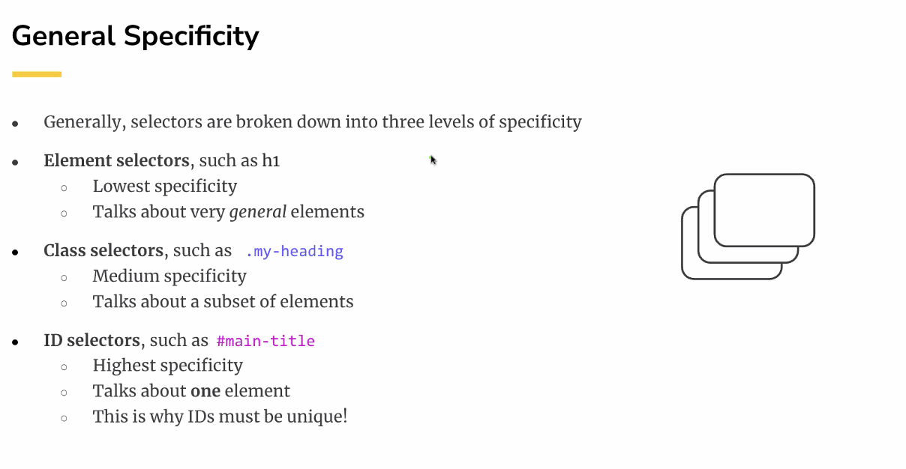
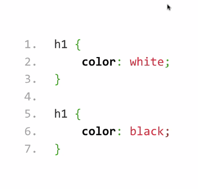
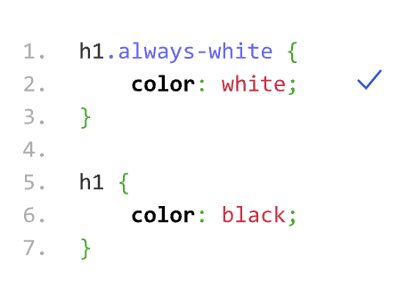
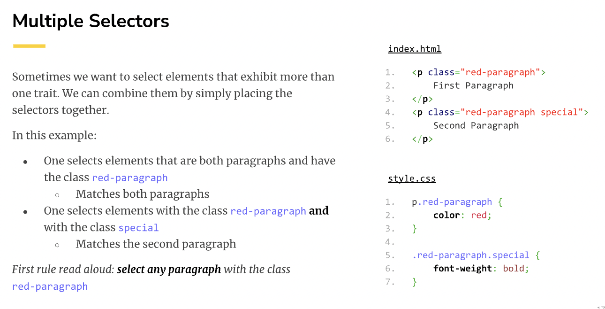
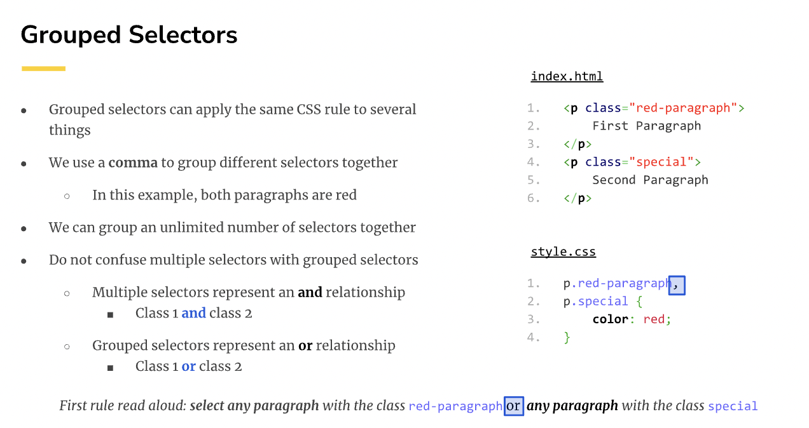
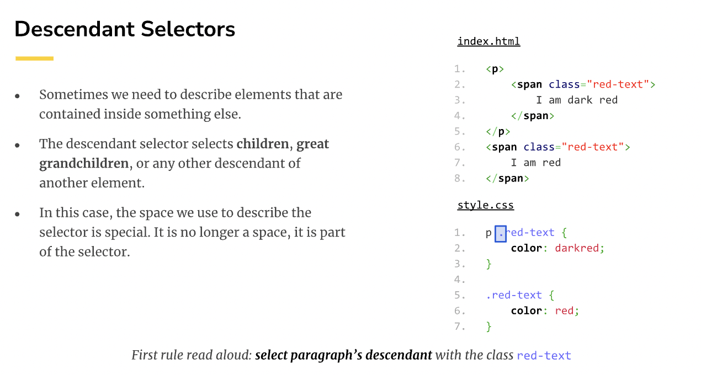
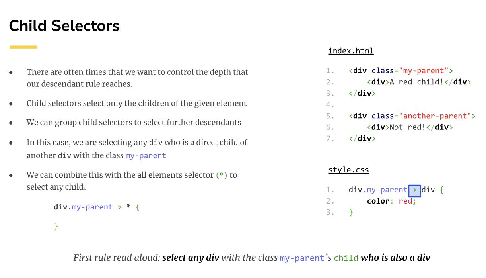
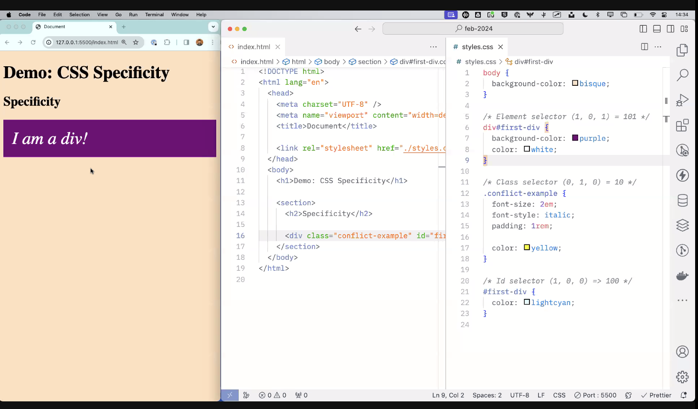
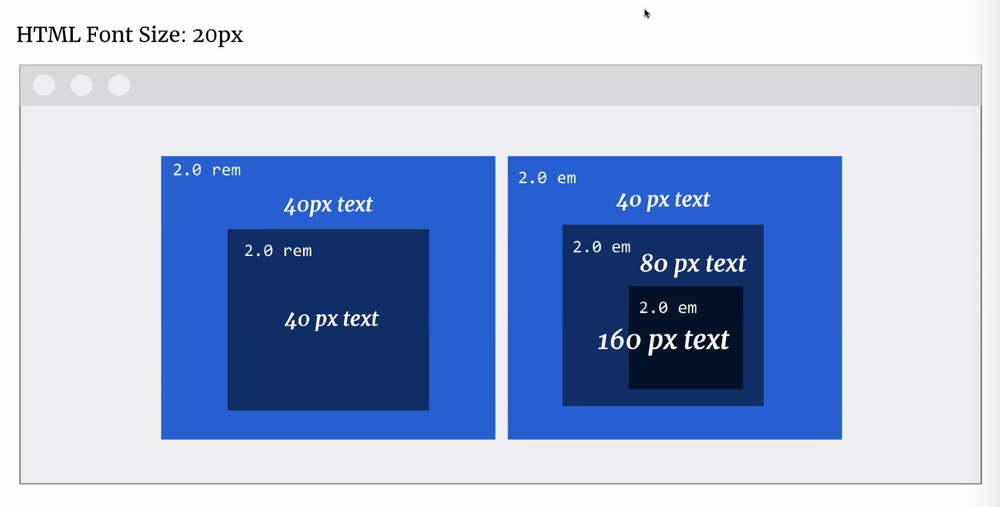
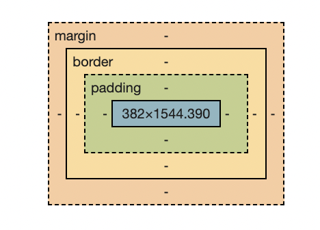

# HTML(Hypertext Markup Language)
HTML is a markup language used to structure content on the web. It provides a standardized way to create and organize text, images, links, forms, and other types of content within a web page.
## Create an 'index.html'
1. open a vscode workplace

2. Create and name your first 'index.html'
    Right click / double click to create your first 'index.html'.
    ***Note:*** You can also drag your folder into workplace.

3. The tempplate!

    Type `!`, then get the boilerplate as below:
    ```html
    <!DOCTYPE html>
    <!-- The lang attribute in the <html> tag is used to specify the language of the document. -->
    <html lang="en">
    <head>
        <meta charset="UTF-8">
        <meta name="viewport" content="width=device-width, initial-scale=1.0">
        <title>Document</title>
    </head>
    <body>
        <!-- Your code is here. -->
        <header>
            <h1>Demo: HTML</h1>

            <nav>
                <ul>
                    <li>
                        <a href = "URL"></a>
                    </li>
                    <li>
                        <a href = "URL"></a>
                    </li>
                    <li>Third item</li>
                </ul>
            </nav>
        </header>

        <figure> 
            
            <figcaption> Figure 1.1: An image </figcaption>
        </figure>

    </body>
    </html>
    ```

4. Get the extention to speed your coding!

    `Live Server`: used in web development to create a local development server and provide live reloading functionality.
    `Prettier`: code formatter

    ***Note:*** Live Server automatically reloads the web page in the browser whenever changes are made to the source code. 


### NOTE:
* `<body></body>`: choose the right elements to start coding.

* What are the differents of article, section, div?
    
    1. Semantic elements:Use `<article>`, `<figure>`
        The details of how to locate the local imgs can be found :https://synapse.brainstation.io/software-engineering-bootcamp/student-content/00a30322-4623-551a-8ad5-e033d62f59c2-->

        
        * for example: 
        ```html
        <figure> 
            
            <figcaption> Figure 1.1: An image </figcaption>
        </figure>
        ```
    2. No Semantic elements: Use `<section> `,`<div>`
    
* Format of elements:
`<element attribute="value">Content</element>`

* `MDN`: helps you seach for html elements and descriptions.

# CSS (Cascading Style Sheets):
CSS is a style sheet language used to control the presentation and layout of HTML documents. It enables designers and developers to apply styles, such as colors, fonts, spacing, and positioning, to enhance the visual appeal and user experience of a web page.
## Create an 'styles.css'

***Note:*** Type `space` when coding will not be reflected in the live pages.

**cascade** and **specifity** tell us which rules apply to different elements in the case that two rules conflict.


Example:
```html
<h1 class = "featured">Content</h1>
```
```css
h1{
    color: white;

}
.featured{
    color: red;

}
```
`white` will be overwrited by `red` since `.featured` is much more specific.

We can find the more details about selectors: https://synapse.brainstation.io/software-engineering-bootcamp/student-content/3a7f3fbc-0ffe-560b-9ebc-8d8ac5298eca


**1. General specificity**


* Element Selectors 
    ```css
    /* Link the stylesheet to any .html */
    <link rel="stylesheet" href = "./PATH/FILENAME.css">

    body{
        background-color:pink;
        font-family:sans-serif;
    }
    /* `;` IMPORTANT! */
    ul{
        list-style-type: none;
        margin: 0;
        padding: 0;
    }

    li{
        display: inline-block;
        margin-right: 1rem;
    }
    ...

    ```
    Element selectors are to the styling for the elements.

* Class Selectors

    Add attribute class `featured` to an element, any elements contain this class will be changed by `featured`.
    ```styles.css
    .featured{
        background-color:yellow;
        color:purple;
    }
    ```
    Used in `.html`
    ```html
    <a href = "./path/link" class = "featured">Content<a>

    <h2> The basic of <span class = "featured">HTML </h2>
    ```

* ID Selectors
    ```css
    #first-paragraph{
        font-weight:bold;
    }
    ```
    Used in `.html`
    ```html
    <p id = "first-paragraph"> This is a demo</p>
    ```


**2. Equal Specificity**

Two cases:

a. Equally specific selectors do not define the same property

    ANS: all the properties got applied

b. Equally specific selectors define the same property - > conflict
    
    ANS: The most recent property get applied (color black) since the previous one got overwrited.



***Note:***
* What if we still want to apply the first rule?

    ANS: Be more specific when defining the color




3. Complex selectors

* **Multiple selectors**



* **Grouped selectors**



* **Descendant selectors**



* **Child selectors**


4. The Cascade
When there are multiple possible values for a property of an element, the browser needs to decide which value should take precedence. It does this by considering how specific the styles are.

The specificity of a style rule, from most specific to least specific, are as follows:

* `!important`(1,0,0,0,0): highest priority for styling.
* Styles specified inline (from the style attribute)
    *  Inline style(1,0,0,0): apply the style directly into the elements.

*  Styles from ID selectors
    * ID selector(1,0,0) - > 100

* Styles from Class selectors
    * Class selector(0,1,0) - > 010

* Styles from Tag selectors
    * Element selector(0,0,1) - > 001

* Inherited styles

* Default styling



    ```css
    /* Equal specificity: order is important*/
    .class-one{
        color: greenyellow;
    }
    .class-two{
        color:lightsalmon;
    }

    /* Multiple selectors*/
    .class-one.class-two{
        color:orange;
    }

    /*Grouped selectors*/
    .class-one,
    #special-element{
        font-weight: bold;
        font-size:150%;
        color: black;
    }

    /*Fine example*/
     .class-one#special-element{
        font-weight: bold;
        font-size:150%;
        color: black;
    }


    .grandparent{
        margin:2px;
    }

    /* Descendant selector*/
     .grandparent .child{
        background-color: yellow;
    }

    /*child selectors*/
    .grandparent > .parent{
        background-color: pink;
    }

    /* Pseudo-classes: every two */
    ul>li:nth-of-type(2n){
        color: lightseagreen
    }


    div{
        color:white !important;
    }

    ```

## CSS Units
CSS Units refer to the possible units of measurement for CSS properties.

**Absolute**
Absolute length units are fixed in relation to each other. They are mainly used in an already known (development) environment (iPhone, tablet).

* px
    * widely used
    * ~0.26mm (CSS pixel)
    * 1 px in desktop not the same as that in mobile device
* cm, inches, mm (x)
    * Rarely used

**Relative**
specify a length relative to another length.
* % 
    * Relative to containing block
    * Containing block needs to hav a value set
    * Great for defining widths
* em, rem 
    * Relative to font size of current element (em). 
        * The em unit allows setting the font size of an element relative to the font size of its parent. When the size of the parent element changes, the size of the child changes automatically.
        * Note: When em units are used on font-size property, the size is relative to the font-size of the parent. When used on other properties, it’s relative to the font-size of that element itself. Here, only the first declaration takes the reference of the parent.
    * Relative to root font size (rem).
        * The rem is based upon the font-size value of the root element, which is the <html> element. And if the <html> element doesn’t have a specified font-size, the browser default value of 16px is used.
    * ref: https://www.geeksforgeeks.org/difference-between-em-and-rem-units-in-css/

* vh,vw
    * Relative to 1% of viewport height or width （1 vh/vw）
    * shrink with height/width
    * vh is great for making full height banners
* vmin
    * Relative to 1% of viewport smallest side (vh or vw)
* vmax
    * Relative to 1% of viewport largest side (vh or vw)

***NOTE:***

1. Browser has default margin set.

2. `width: unset` unset the parent relation
3. Font size is bigger than the parent box (if height of parent is fixed and child is bigger than current box)
4. viewpoint represents the visible area of a web page in a browser.


